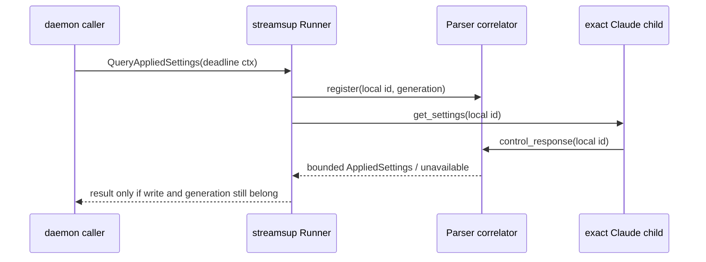

# 2505 — read Claude's applied effort through `get_settings`

## Files read

- `internal/streamsup/envelope.go` → `controlRequest`, `controlRequestInner`,
  `WriteMCPStatus`, `WriteContextUsage` — the structured one-line control-request
  writers the fixed `get_settings` envelope must mirror.
- `internal/streamsup/runner.go` → `Runner`, `QueryMCPStatus`,
  `QueryContextUsage`, `nextControlID`, `spawnAndWait`, `takeStdin` — the live-child
  snapshot, local-id minting, generation recheck, write-verdict ordering and two
  child-boundary retirement points this query inherits.
- `internal/streamsup/parser.go` → `Parser`, `beginMCPStatusChild`,
  `contextUsageQueries`, `claimContextUsageQuery`, `decodeContextUsage`,
  `mcpStatusQueries`, `claimMCPStatusQuery`, `consumeLine` — the private reply
  ownership pattern and the control-response ordering that keeps claimed payloads
  out of shared events and logs.
- `internal/streamsup/mcp_status_query_test.go` →
  `mcpStatusQueryWriteCloser`, `TestRunner_QueryMCPStatus_WriteFailureWinsOverEarlyResponse`,
  `TestRunner_QueryMCPStatus_ChildExitFailsPendingQuery` — reusable fake writer and
  the discriminating early-reply/write-failure plus teardown proofs.
- `internal/streamsup/context_usage_query_test.go` →
  `TestRunner_QueryContextUsage_OverlappingQueriesCorrelateIndependently`,
  `TestRunner_QueryContextUsage_UnserviceableAskReturnsNotAnswered`,
  `TestContextUsageQueryIDPrefix_DisjointFromSiblingNamespaces` — the nearest
  complete private-query test surface, including replacement isolation.
- `cmd/pyry/streamsup_runner.go` → `streamRunner`, `QueryMCPStatus`,
  `QueryContextUsage` — the concrete, intentionally off-`sessions.Runner` adapter
  convention.
- `internal/e2e/realclaude/interactive_stream_inband_model_test.go` →
  `inbandRunner`, `inbandWaitForChild`, `TestInteractiveStream_InBandModelChange_LiveChildReportsNewModel`
  — direct live `streamsup.Runner` construction, authenticated child cleanup and
  pre-turn initialize-menu observation.
- `internal/e2e/realclaude/resilience_test.go` → `resolveClaudeBin` — the tagged
  suite's real-binary discovery and safe skip contract.
- `internal/e2e/realclaude/fixtures.go` → `WithWorktreeAuthenticated` — isolated
  authenticated HOME setup for each real-Claude run.
- `internal/turnevent/event.go` → `ModelList`, `ModelOption.EffortLevels` — Claude's
  bounded menu of effort levels, used to choose the explicit live arm from the
  installed binary rather than a permanent daemon vocabulary.
- `docs/knowledge/features/streamsup-package.md` → “Testing” and the
  `QueryContextUsage` section — an early response must wait for the writer's verdict,
  and pending private reads retire at both child boundaries.
- `docs/knowledge/features/development-verification.md` → “Protocol boundaries” and
  “Test execution and artifact survival” — distinguish absent from explicit null in
  raw JSON and never infer a live execution from exit status alone.
- `docs/knowledge/features/e2e-realclaude.md` → live-suite gate contract — the tagged
  test is dispatcher-owned, credential-dependent evidence and does not create a
  fixture.
- `docs/specs/architecture/2430-context-usage-query.md` → `QueryContextUsage` design
  and revisions — the nearest shipped request/reply ownership analogue.

## Context

Claude Code 2.1.259 was observed answering `get_settings` before any user turn with
the model and effort it had actually applied. The existing `system/init` decoder
cannot answer the effort half: the field remains absent even when effort was set.
This slice adds only an in-process read from the concrete stream runner and its
`cmd/pyry` adapter. It creates no protocol frame, does not widen `sessions.Runner`,
and leaves publishing to clients to #2507.

The refiner estimates about 1,200 written lines, above the ordinary 800-line ceiling.
The floor rule keeps the ticket whole: the correlator has exactly one concrete-runner
adapter consumer, while the live arm is the only independently observable proof that
Claude accepts the request before a turn and applies an advertised explicit level.
Separating any of the three would create a one-sibling-only deliverable. The planned
production surface is four files, one exported result type, one adapter call site,
four acceptance criteria and no interface/signature migration.

No ADR is warranted. This is another instance of the existing child-scoped private
control-query pattern, not a new package or cross-process contract.

## Design

### Result contract

`internal/streamsup` exports one data-only result:

```go
type AppliedSettings struct {
    Model  string
    Effort *string
}

func (r *Runner) QueryAppliedSettings(ctx context.Context) (AppliedSettings, bool)
```

`bool=true` means Claude returned one successful, usable applied-settings object.
`Effort != nil` preserves a reported string verbatim; `Effort == nil` preserves an
explicit JSON `null`. `bool=false` is the third outcome, unavailable, and covers every
transport, lifecycle, correlation or validation failure without inventing a value.

Both strings are cloned before crossing the decoder boundary. Model is non-empty and
bounded by the existing resolved-model byte ceiling; a string effort is bounded by the
existing effort-level byte ceiling. Effort is decoded through `json.RawMessage`, so a
missing field cannot collapse into explicit `null`. The decode target names only
`applied`, `model` and `effort`; effective settings, sources and all sibling values are
structurally unreachable.

### Request and private reply ownership

`WriteAppliedSettings` emits exactly one structured, newline-terminated request whose
subtype is `get_settings` and whose request object has no other key. The runner mints a
request id under a new prefix from `nextControlID`; no caller value enters the envelope.
The prefix remains pairwise non-prefixing with the MCP, context-usage and bare decimal
namespaces because every private correlator consumes late unregistered ids in its own
namespace.

The runner follows `QueryContextUsage`'s ordering:

1. reject an ended context, a context without a caller deadline, a missing parser or
   no eligible live binding without writing;
2. snapshot stdin and `childGeneration` under `Runner.mu`;
3. register the pending id outside that leaf lock, then recheck the same generation;
4. write `get_settings`, publish the write verdict, and let an early reply wait for it;
5. return the correlated result or remove the pending entry on cancellation/deadline.

Requiring a caller deadline makes “deadline-bounded” an API invariant rather than a
comment that a future caller can accidentally ignore. It also caps the pending map for
a live child that stays silent. Cancellation before or during the exchange is the same
unavailable outcome.

`Parser` gains a dedicated `appliedSettingsQueries` map rather than widening another
payload's map. Its claim runs with the existing private claims at the top of the
`control_response` arm, before shared event and control-response logging. Matching the
id is terminal even when subtype or payload validation fails. Both
`beginMCPStatusChild` and `takeStdin` fail every pending applied-settings waiter so a
predecessor reply cannot answer for its successor.



### `cmd/pyry` adapter

`streamRunner.QueryAppliedSettings` forwards to its concrete `*streamsup.Runner` and
returns `streamsup.AppliedSettings`. It remains off `sessions.Runner`, like the two
existing private query methods. This ticket adds no production caller; #2507 will own
the client-facing deadline and projection.

### Live proof

A tagged real-Claude test starts two fresh direct `streamsup.Runner` children under an
authenticated isolated HOME. Both use distinct session ids/workdirs, model `opus`, and
`--setting-sources ""` so saved settings cannot choose effort.

The inherited child asks for `initialize`, waits for its bounded `ModelList`, then calls
`QueryAppliedSettings` before any user turn. The test selects an untruncated effort
level from the installed binary's `opus` menu. The explicit child starts with exactly
that `--effort` value and is queried before any user turn. A narrow stdout tap decodes
each raw `response.applied` independently of the production decoder; both returned
fields must agree with that child's raw reply, the explicit result must equal the
selected advertised level, and the inherited arm compares only to its observed reply,
never to `high` or another fixed default.

No fixture is written, so this ticket does not need the live-artifact return path.

## Concurrency model

Production adds no goroutine. Concurrent callers register in a mutex-protected map;
Claude stdout stays on the parser's single writer. `Runner.mu` and the correlator mutex
are never nested: snapshot, register, and generation recheck are separate acquisitions.

Each pending query has a once-closed write-verdict channel and a buffered one-result
channel guarded by `sync.Once`. The parser may claim an early reply while `Write` is
still returning; it waits for the verdict and reports unavailable if that write fails.
Claim, cancellation, deadline expiry and child retirement can race without blocking the
stdout goroutine or sending twice. A replacement first drains the old generation's
waiters; its replies cannot satisfy or be satisfied by the predecessor's ids.

## Error handling

The query returns unavailable for: missing deadline, prior or in-flight cancellation,
no parser, no live child, rotation, generation change, child exit/replacement, write
failure, unmatched id, non-success subtype, absent/null/non-object `applied`, absent or
non-string/empty/oversized model, and absent/non-null/non-string/oversized effort. The
first matched response is terminal, so a later corrected duplicate cannot revive it.

Nothing on the path logs. Writer errors use fixed context that admits neither the local
id nor any child payload. The parser claim precedes the shared control-response logger,
so even effective settings, paths or credentials carried beside `applied` cannot reach
records through this feature.

## Testing strategy

RED starts with focused tests calling the missing method and adapter, then observing the
expected compile failure. The test suite then covers:

- exact one-line `get_settings` envelope, locally prefixed id, and no request fields or
  user turn beyond the fixed subtype;
- successful string effort and explicit `null`, including copies that survive mutation
  of the input buffer;
- overlapping ids completed out of order, unknown/late ids isolated, and the prefix
  remaining disjoint from every sibling namespace;
- table-driven non-success, missing, wrong-typed, empty and oversized field failures;
- no parser/live child/deadline, prior cancellation, cancellation and deadline while
  waiting, plus both teardown and replacement retirement boundaries;
- the discriminating early-reply test in which the parser claims while the writer is
  blocked and the writer then fails;
- no shared event or debug record, even when the response contains sensitive sibling
  sentinels;
- compile-time satisfaction of a narrow adapter interface in `cmd/pyry`;
- the two-session tagged live proof described above, compiled offline here and executed
  later by the dispatcher-owned real-Claude gate.

Builder gate: `go test -race ./internal/streamsup/...`, `go vet ./...`, and
`go build ./cmd/pyry`; additionally compile the tagged real-Claude package without
executing tests. The dispatcher/verifier owns the full-module race suite and actual
real-Claude execution.

## Open questions

None. The ticket and existing query pattern settle ownership, lifetime, payload shape,
deadline policy and the later client boundary.

## Documentation handoff

The ticket contains no documentation-only acceptance criterion and requires no edit to
`docs/protocol-mobile.md`; #2507 owns the future wire publication. The documentation
stage should update `docs/knowledge/features/streamsup-package.md` in its private-query
section with `QueryAppliedSettings`, the nullable-effort contract and the live
`get_settings` finding.

## Security review

**Verdict:** PASS

**Findings:**

- **[Trust boundaries]** No MUST FIX. Outbound, `WriteAppliedSettings` serialises only
  a local id and fixed subtype. Inbound, `decodeAppliedSettings` is the single boundary
  where child-authored JSON becomes state, and its narrow targets make every setting
  except model and effort unreachable. The result remains an untrusted report by the
  child, not an authorization fact; #2507 must treat it as display data.
- **[Tokens, secrets, credentials]** No MUST FIX. `nextControlID` is predictable because
  it is a correlation token handed to the same child, not a secret or capability. The
  new prefix is disjoint, ids are process-local, retired on completion/boundary, and
  never logged. Credentials and environment values have no declared decode field.
- **[File operations]** No findings by design: the production path creates, opens,
  stats and names no file. The live test uses existing authenticated-HOME and temp-dir
  fixtures and writes no durable artifact.
- **[Subprocess / external command execution]** No MUST FIX. The feature spawns no new
  command and sends no caller-controlled argument or shell text. It writes one JSON
  control request to the already-open child stdin. The live test's explicit effort is
  selected from that installed child's bounded menu and passed as one argv element,
  never through a shell.
- **[Cryptographic primitives]** No findings: the feature creates no security token,
  key, nonce, hash or comparison. Counter ids need uniqueness and namespace separation,
  not entropy.
- **[Network & I/O]** No MUST FIX. The existing parser line ceiling bounds the full
  response; `decodeAppliedSettings` additionally caps model and string effort before
  retention and returns independently owned copies. A required caller deadline plus
  cancellation and both child-boundary drains bounds every pending entry, including a
  live silent child. No network listener or timeout policy changes.
- **[Error messages, logs, telemetry]** No MUST FIX. The query logs nothing, writer
  errors contain fixed operation names only, and the private claim runs before the
  existing control-response record. The exported type cannot carry effective settings,
  sources, paths, environment values or credentials. Its doc must state that model and
  effort are child-authored display data and must not be logged as trusted facts.
- **[Concurrency]** No MUST FIX. `Runner.mu` is never nested with the correlator mutex;
  register-before-generation-recheck closes the replacement gap; the write-verdict
  channel resolves the early-response race; and `sync.Once` plus a buffered result lets
  claim, timeout and boundary retirement race without blocking the stdout forwarder.
  Production creates no goroutine and therefore adds no shutdown path.
- **[Threat model alignment]** OUT OF SCOPE by ticket boundary, not omission. No relay,
  protocol or client can reach this concrete-runner method in #2505. Publishing the
  informational value and choosing its client-safe projection belongs to #2507 and
  must receive its own security review.

**Reviewer:** builder (self-review per the security-review checklist)
**Date:** 2026-09-20
